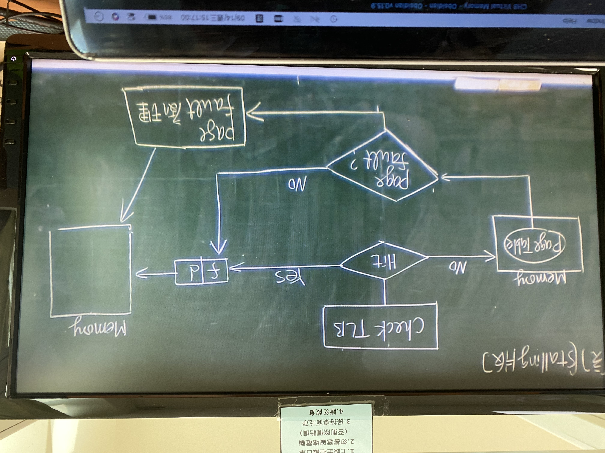

# Ch8 Virtual Memory

- ## 主要目的及附帶好處 #⭐️
  1. 允許process size 在超過physical memory free space size 之下，仍能執行。
  ->logical memory size 不會受到physical memory size 之限制
  1. 觀念：即是"Partial" loading process部分內容, process 即可執行(even 不載入也可執行）
     - 早期：dynamic loading（ＯＳ無額外支持）
     - 現代：OS提供VM特性
  2. 其他附帶好處
     1. 若process只載入一部分即可執行\
        ->同時間內可載入的process數量變多\
        ->CPU utilization 相對高\
        `NOTE:Thrash 情況除外`
     2. less I/O Time(因為量少)
     3. Memory utilization相對較高
     4. programmer無須煩惱 process size太大的問題，只需專心把程式寫正確
     5. ~~Copy-on-write技術~~
- ## Demand Pageing 技術 #⭐️

  > 定義：架構在前面的Page Memory  Management 基礎。差別：process執行之前，無須事先載入所有的Pages，而是載入部分所需（demand）之Pages即可執行
  > ==NOTE:也可以不載入任何page即可執行，此為_pure demand paging_。
  > 若事先載入猜測的pages叫做[prepaging](prepaging.md)==

  需要有一個機制區分哪些pages不再memory中
  ==NOTE:[CH7] valid & invalid paged==

  ### 圖示：

  
- ## Page fault 之處理 #⭐️⭐️⭐️
  Steps:
  1. MMU 送出一個中段通知OS
  2. OS收到中斷後，暫停目前process之執行且保存此process之status(eg. p.c. registers value...etc)
  3. OS依此存取位址判斷是否是合法存取。
     若非法則終止此process。
     合法則判定是page fault引起
  4. Then, OS去Memory中找尋可用頁匡，若沒有，則需執行_Page replacement_，以空出一個free frame
  5. Then, OS再到Disk確認lost page所在位置，啟動Disk I/O運作載入lost page 到free frame。
  6. Then, OS修改page table標示錯lost page的frame No.並將Invalid改為Valid值
  7. OS恢復原本中斷前之process之執行
  ==NOTE: p.245是more steps==
- ## EMAT計算 #⭐️⭐️⭐️⭐️
  - EMAT公式
    `  = (1-p)*{Memory Access Time} + P * {Page fault 處理時間} `
    其中P : page fault ratio
  - 例：
    ```txt
    	Memory access time: 100ns
    	page fault processing time: 5ms
    	(1)若page faultratio = 20%
    	求EMAT?
    		Ans:(1-0.2)*100ns+0.2*5ms = 80ns + 1ms = 1000080ns
    	(2)若EMAT不超過10𝜇s 則page fault應< ?
    		Ans:
    		(1-p)*100ns+p*5ms < 10𝜇s
    		100 - 100p + 5000000p < 10000
    		499900p < 9900
    		=> p< 99/4999 ~= 1/500
    ```
  - 圖示(stalling)：
	
  > 小結：提及VM效能，即是要降低EMAT，而關鍵點：_要降低page fault ratio_
- ## 影響page fault ratio 因素
  - ### [Page Replacement](Page%20Replacement.md)法則之選擇
  - ### Frame 數分配多寡之影響
  - ### Page size影響
  - ### program structures影響
- ## [Page Replacement](Page%20Replacement.md)法則 #⭐️⭐️⭐️⭐️⭐️ 
	==NOTE:在所有replacement法則中，沒有最差的==
	1. [FIFO](FIFO.md)
	2.  [OPT](OPT.md)
	3.  [LRU](LRU.md)
	4.  LRU近似
		1.  Additional Reference Bit Usage
		2.  Second chance(or clock)
		3.  Enhanced Second chance
	5.  Counting Algo.
		1.  LFU
		2.  MFU
	6.  page Buffering 機制
- ## Modification(Dirty)Bit, [Belady Anomaly](Belady%20Anomaly.md), stack property #⭐️⭐️⭐️⭐️
- ## Frame數目分配多寡之影響 #⭐️⭐️
- ## Thrashing 及解法 #⭐️⭐️⭐️⭐️⭐️
- ## Page size 之影響 #⭐️⭐️⭐️
- ## program structure 影響 #⭐️⭐️⭐️
- ## copy-on-write技術 #⭐️⭐️⭐️
- ## TLB Reach #⭐️⭐️
