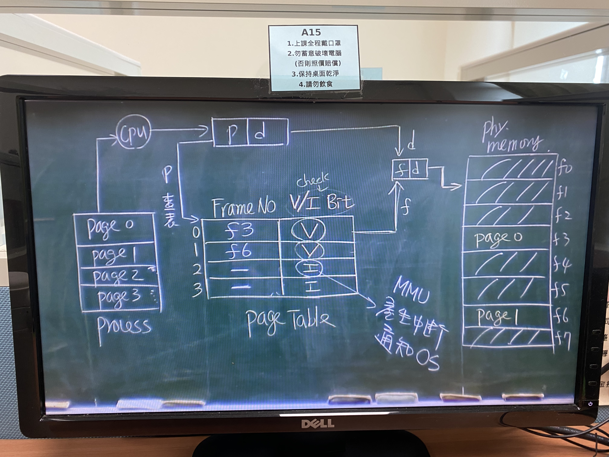

# Page Replacement

> 定義：當_Page fault發生且memory中無free frame_時，OS必須執行此工作，即是要_排出一個Victim page(or the replaced page)將他swap out 到Disk保存_，以空出一個free frame 供miss page 載入之用

### 圖示：

- 為降低額外的swap out 之i/o次數，故在page table 在引進一個欄位：[Modification Bit](Modification%20Bit.md)
- OS在selects Victim page 時，有兩大策略
  1. ##### [Local replacement policy](Local%20replacement%20policy.md)
  2. ##### [Global replacement policy](Global%20replacement%20policy.md)
